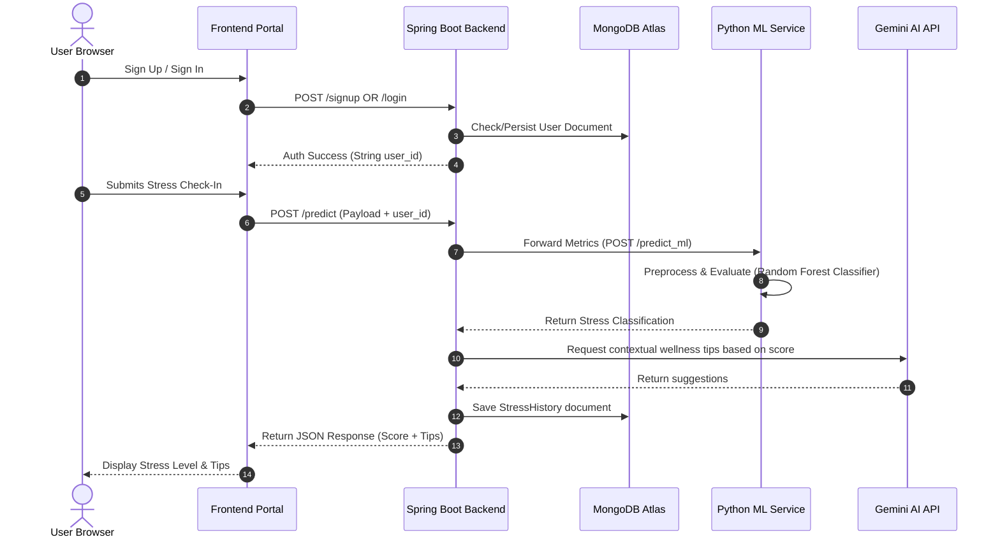

# CalmPulse

> **An Intelligent Wellness & Stress Analytics Platform Powered by Spring Boot, Python ML, and Gemini AI**

[](https://spring.io/projects/spring-boot)
[](https://www.mongodb.com/)
[](https://www.python.org/)
[](https://scikit-learn.org/)
[](https://ai.google.dev/)
[](LICENSE)

---

## 1. Project Overview

**CalmPulse** is a dual-engine wellness application designed to assess, track, and mitigate stress for **students** and **employees**. By merging a robust **Spring Boot REST API** with a dedicated **Python Machine Learning microservice** and **Gemini AI LLM endpoints**, CalmPulse provides users with real-time stress classifications, personalized coping recommendations, persistent historical analytics, and an interactive cognitive-support chatbot.

---

## 2. Problem Statement

Chronic stress in high-pressure academic and professional environments leads to burnout, low productivity, and long-term mental health challenges. Traditional mental health applications are often purely informational or lack data-driven personalization. Users need a system that:
*   Passively evaluates their daily metrics (e.g., study load, work hours, sleep quality).
*   Applies scientifically backed predictive algorithms to classify their stress levels.
*   Retains structured logs to track wellness trends over time.
*   Offers instant, context-aware digital counseling to help manage stress.

---

## 3. The Solution

CalmPulse provides a unified, cross-domain stress management portal. Users define their profile as either a student or employee. When they perform a "Check-In":
1.  A **custom-trained Random Forest Classifier** processes their survey inputs to calculate a stress score (Low, Medium, High).
2.  The backend stores this interaction securely in **Cloud MongoDB Atlas**.
3.  The backend coordinates with **Gemini AI** to construct tailored wellness recommendations.
4.  An interactive chat interface (**Pulse Bot**) allows users to request personalized coping exercises, mindfulness prompts, and cognitive-behavioral strategies.

---

## 4. Key Features

*   **Role-Based Dynamic Check-ins**: Separate interfaces and indicators tailored for academic stress (anxiety, peer pressure, study load) and workplace stress (working hours, remote satisfaction, virtual meetings).
*   **Predictive ML Analytics**: Under-the-hood Random Forest models classify stress levels instantly.
*   **Structured Persistence**: Automated MongoDB historical logging of all survey and check-in inputs.
*   **Wellness History Dashboard**: Visualizes previous stress score logs, sleep indices, and behavioral patterns.
*   **Pulse Bot Chatbot**: An AI wellness companion powered by Gemini for interactive stress-relief guidance.
*   **Profile Personalization**: Secure signup, login (with BCrypt hashing), profile setup, and customizable user modes.
*   **Voice Inputs**: Integrated Web Speech API enabling hands-free voice commands to fill surveys.

---

## 5. Technology Stack

### Frontend
*   **Structure & Logic**: HTML5, Vanilla JavaScript (ES6+), Web Speech API.
*   **Styling**: CSS3 with sleek modern layout grids, dynamic glassmorphism cards, and interactive hover animations.

### Backend (Spring Boot Core)
*   **Framework**: Spring Boot 3.3.1 (Java 21).
*   **Security**: Spring Security (permit-all routing configuration, CORS filtering, BCrypt password encoder).
*   **Data Access**: Spring Data MongoDB.
*   **Documentation**: Springdoc OpenAPI / Swagger UI.

### Machine Learning Microservice
*   **Server**: Flask (Python 3.11) served via Gunicorn.
*   **Core Libraries**: Scikit-Learn (1.7.1), Pandas, NumPy, Joblib.

### Database & Cloud Integrations
*   **Database**: Cloud MongoDB Atlas.
*   **AI Integration**: Google Generative Language API (Gemini 2.0 / 1.5 Flash).

---

## 6. System Architecture / Workflow



---

## 7. Project Structure

```
CalmPulse/
├── Front end/
│   └── CalmPulse/
│       ├── images/               # Image assets
│       ├── api-config.js         # API Endpoint selector
│       ├── chat.html             # Pulse Bot Interface
│       ├── dashboard.html        # User Dashboard & survey inputs
│       ├── history.html          # Stress Logs viewer
│       ├── Info.html             # Information forum
│       ├── index.html            # Landing Page
│       ├── signin.html           # Login Portal
│       ├── signup.html           # Registration Portal
│       ├── post-login.css        # Dashboard Styles
│       └── style.css             # Main stylesheet
├── ML/
│   ├── employee_model.pkl        # Serialized Random Forest model for workplace stress
│   ├── student_model.pkl         # Serialized Random Forest model for academic stress
│   ├── data_prep.py              # Data cleaning and scaling pipeline
│   ├── eda.py                    # Exploratory data analysis scripts
│   ├── model_development.py      # ML Model training configuration
│   ├── prediction_service.py     # Flask Microservice exposing port 5001
│   └── requirements.txt          # Python ML dependencies
└── backend/
    ├── pom.xml                   # Maven project descriptor
    ├── Dockerfile                # Multi-stage Docker image descriptor
    └── src/
        └── main/
            ├── java/com/calmpulse/backend/
            │   ├── client/       # ML API HTTP client wrapper
            │   ├── config/       # SecurityConfig, RestTemplate configuration
            │   ├── controller/   # Auth, Profile, Predict, History, Chat Controllers
            │   ├── dto/          # JSON Request/Response structures (DTOs)
            │   ├── entity/       # User & StressHistory MongoDB Documents
            │   ├── exception/    # Custom runtime exceptions & GlobalExceptionHandler
            │   ├── repository/   # UserRepository, StressHistoryRepository interfaces
            │   └── service/      # Auth, Predict, History, Chat services
            └── resources/
                └── application.properties  # Database, Server and API port settings
```

---

## 8. Installation & Setup Instructions

### Prerequisites
*   Java Development Kit (JDK) 21
*   Maven 3.8+
*   Python 3.11+
*   MongoDB Atlas Account (or local MongoDB Community instance)

---

### Step 1: Clone the Repository
```bash
git clone https://github.com/YOUR_USERNAME/CalmPulse.git
cd CalmPulse
```

---

### Step 2: Configure & Run the Python ML Service
1. Navigate to the `ML/` directory:
   ```bash
   cd ML
   ```
2. Install the python dependencies:
   ```bash
   pip install -r requirements.txt
   ```
3. Start the ML Flask microservice:
   ```bash
   python prediction_service.py
   ```
   The ML service will start running locally on `http://localhost:5001`.

---

### Step 3: Configure & Run the Spring Boot Backend
1. Navigate to the `backend/` directory:
   ```bash
   cd ../backend
   ```
2. Configure your database details and API keys in `src/main/resources/application.properties` (or export them as environment variables).
3. Build and package the project:
   ```bash
   mvn clean package -DskipTests
   ```
4. Start the application:
   ```bash
   mvn spring-boot:run
   ```
   The backend will start and listen on port `8080`.
   *   Swagger UI: `http://localhost:8080/swagger-ui/index.html`
   *   API Documentation JSON: `http://localhost:8080/v3/api-docs`

---

### Step 4: Access the Frontend
Open the frontend files locally by double-clicking `Front end/CalmPulse/index.html` or hosting the directory on a static web server. Ensure `api-config.js` is correctly pointing to your Spring Boot API endpoint (`http://localhost:8080` for local testing).

---

## 9. Environment Variables

Specify these variables in your OS configuration or pass them as system properties:

| Variable | Description | Default Value |
| :--- | :--- | :--- |
| `MONGO_URI` | Connection String for MongoDB Cluster | (Uses Atlas cluster specified in `application.properties`) |
| `GEMINI_API_KEY` | Developer API Key for Google Generative AI | `YOUR_API_KEY` |
| `ML_SERVICE_URL` | Base URL endpoint for Python ML microservice | `http://localhost:5001` |
| `PORT` | Running port for the Spring Boot / Python services | `8080` / `5001` |

---

## 10. API Documentation

### Authentication & Profiles

#### `POST /signup`
Registers a new user account.
*   **Request Payload**:
    ```json
    {
      "email": "user@example.com",
      "password": "SecurePassword123",
      "first_name": "John",
      "last_name": "Doe",
      "contact": "9876543210",
      "role": "student"
    }
    ```
*   **Response (200 OK)**:
    ```json
    {
      "message": "User created successfully",
      "userId": "66e7f1b95b8d21051515f4e2",
      "isNewUser": true,
      "role": "student"
    }
    ```

#### `POST /login`
Logs in an existing user.
*   **Request Payload**:
    ```json
    {
      "email": "user@example.com",
      "password": "SecurePassword123"
    }
    ```
*   **Response (200 OK)**:
    ```json
    {
      "message": "Login successful",
      "userId": "66e7f1b95b8d21051515f4e2",
      "isNewUser": false,
      "role": "student"
    }
    ```

#### `POST /profile`
Updates demographic profile details.
*   **Request Payload**:
    ```json
    {
      "user_id": "66e7f1b95b8d21051515f4e2",
      "first_name": "John",
      "last_name": "Doe",
      "age": 21,
      "gender": "Male",
      "contact": "9876543210",
      "mode": "student"
    }
    ```

---

### Stress Diagnostics & Assistant

#### `POST /predict`
Processes survey answers, classifies stress using ML, and generates AI wellness recommendations.
*   **Request Payload (Student)**:
    ```json
    {
      "user_id": "66e7f1b95b8d21051515f4e2",
      "role": "student",
      "anxiety_level": 15,
      "depression": 12,
      "sleep_quality": 3,
      "academic_performance": 4,
      "study_load": 3,
      "teacher_student_relationship": 2,
      "future_career_concerns": 4,
      "social_support": 3,
      "peer_pressure": 2,
      "extracurricular_load": 3
    }
    ```
*   **Response (200 OK)**:
    ```json
    {
      "stress_score": 1.74,
      "suggestions": [
        "Create a structured study timeline to reduce exam anxiety.",
        "Ensure at least 7 hours of sleep to improve memory consolidation.",
        "Reach out to study groups or peers for academic assistance."
      ]
    }
    ```

#### `GET /history/{userId}`
Retrieves all historical stress records for the specified user.
*   **Response (200 OK)**:
    ```json
    [
      {
        "stressScore": 1.74,
        "timestamp": "2026-07-17T23:10:45Z",
        "factors": {
          "sleepQuality": 3,
          "workingHours": 0,
          "virtualMeetings": 0,
          "anxietyLevel": 15,
          "depression": 12
        }
      }
    ]
    ```

#### `POST /chat_api`
Relays messages to Pulse Bot (Gemini AI).
*   **Request Payload**:
    ```json
    {
      "user_id": "66e7f1b95b8d21051515f4e2",
      "userRole": "student",
      "message": "I feel overwhelmed with my upcoming finals."
    }
    ```
*   **Response (200 OK)**:
    ```json
    {
      "reply": "It's completely normal to feel this way. Let's break down your tasks step-by-step..."
    }
    ```

---

## 11. Database Design

CalmPulse utilizes a document-based schema in MongoDB Atlas for high flexibility, horizontal scalability, and compatibility with the dynamic attributes of check-in records:

### Collection: `users`
```json
{
  "_id": "ObjectId",
  "email": "String",
  "password_hash": "String (BCrypt)",
  "first_name": "String",
  "last_name": "String",
  "contact": "String",
  "age": "Integer",
  "gender": "String",
  "role": "String (student / employee)",
  "is_new_user": "Boolean"
}
```

### Collection: `stress_history`
```json
{
  "_id": "ObjectId",
  "user_id": "String",
  "role": "String",
  "sleep_quality": "Integer (Mapped 1-3)",
  "working_hours": "Integer",
  "virtual_meetings": "Integer",
  "work_life_balance": "Integer",
  "access_to_mental_health": "String",
  "satisfaction_with_remote_work": "String",
  "company_support": "Integer",
  "physical_activity": "String",
  "anxiety_level": "Integer",
  "depression": "Integer",
  "academic_performance": "Integer",
  "study_load": "Integer",
  "teacher_student_relationship": "Integer",
  "future_career_concerns": "Integer",
  "social_support": "Integer",
  "peer_pressure": "Integer",
  "extracurricular_load": "Integer",
  "stress_score": "Double",
  "timestamp": "String (ISO 8601 UTC)"
}
```

---

## 12. Machine Learning Model Details

CalmPulse utilizes two custom-trained **Random Forest Classifiers** optimized for stress level detection.

### 1. Student Stress Classifier
*   **Trained Features**: `anxiety_level`, `depression`, `sleep_quality`, `academic_performance`, `study_load`, `teacher_student_relationship`, `future_career_concerns`, `social_support`, `peer_pressure`, `extracurricular_activities`.
*   **Preprocessing**: Min-Max scaling, categorical mapping for Sleep Quality.
*   **Performance**: Achieved **High Accuracy** during validation split testing.

### 2. Employee Stress Classifier
*   **Trained Features**: `working_hours`, `virtual_meetings`, `work_life_balance`, `access_to_mental_health`, `satisfaction_with_remote_work`, `company_support`, `physical_activity`, `sleep_quality`, `meetings_per_hour`, and One-Hot Encoded `job_role` indicators.
*   **Hyperparameter Tuning**: Tuned using `GridSearchCV` (`n_estimators`, `max_depth`, `min_samples_split`, `min_samples_leaf`).
*   **Output Target**: Discrete Stress levels representing Low, Medium, and High stress.

---


## 13. Future Enhancements

*   **OAuth2 Integration**: Login with Google, GitHub, or school credentials.
*   **Real-time Visualization**: Interactive chart graphs (Chart.js or D3.js) to view stress fluctuations over weeks/months on the dashboard.
*   **Multi-language Support**: Multi-lingual chat capability for Pulse Bot.
*   **Mobile App Companion**: Responsive React Native or Flutter mobile client.
*   **Cron Reports**: Automatic weekly wellness email digests summarizing metrics.

---

